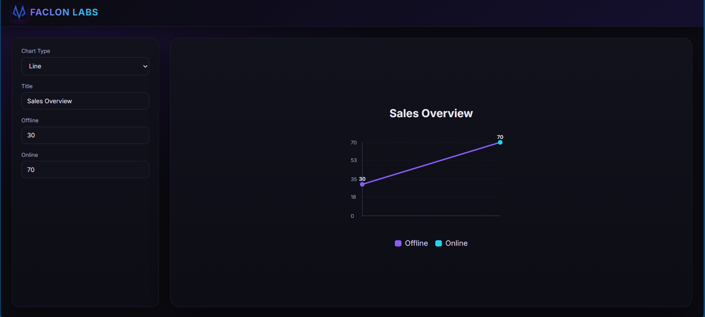
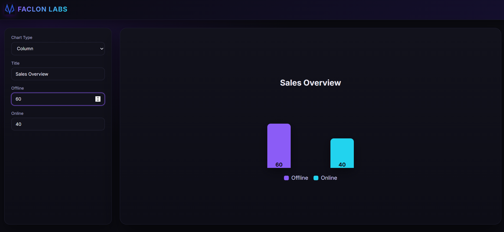
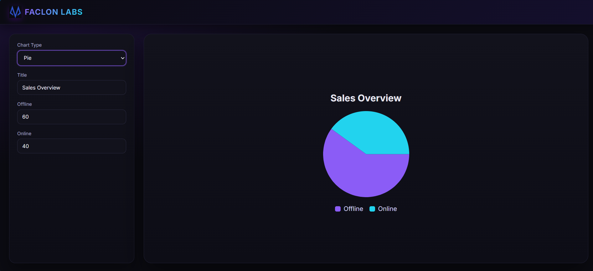

# Faclon LABS – Custom Angular Chart Component

## Overview

This project is a custom-built, reusable Angular chart component that renders Line, Column, and Pie charts based on configuration input. It is built without using any external chart libraries and focuses on component design, SVG rendering, and clean UI.

## Features

- Reusable io-chart component
- Supports Line, Column, and Pie charts
- Dynamic configuration using ChartOptions
- Interactive UI with dropdown and inputs
- Dark modern UI theme
- Axis and measures for line chart
- Tooltips on hover
- Animations for charts
- Dynamic add and remove series
- Responsive centered layout
- No external chart libraries used

## Tech Stack

- Angular (Standalone Components)
- TypeScript
- HTML
- SCSS
- SVG

## Project Structure

- src/app/app.component.* for main UI and controls
- src/app/chart/chart.component.* for reusable chart component
- src/styles.scss for global styling

## Chart API

The chart component accepts the following configuration:

type: 'line' | 'column' | 'pie'  
title: string  
series:  
- name: string  
- value: number  
- color: string  

Example:

type: 'line'  
title: 'Sales Overview'  
series:  
- Offline, 30, violet  
- Online, 70, cyan  

## How to Run

1. Install dependencies   - npm install
2. Start the development server - npx ng serve
3. Open in browser -   http://localhost:4200
4. 

## Screenshots

### Line Chart

### Column Chart

### Pie Chart

## Reusability

The io-chart component can be reused anywhere in the application by passing a different ChartOptions object. Multiple charts can be rendered on the same page using different configurations.

## Limitations

- Basic scaling logic intended for small to medium datasets
- Simple animation system
- Not optimized for very large datasets

## Author

Faclon LABS Assignment Submission

